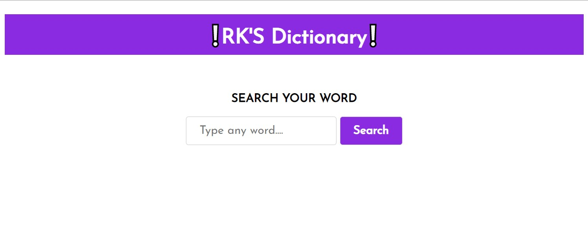
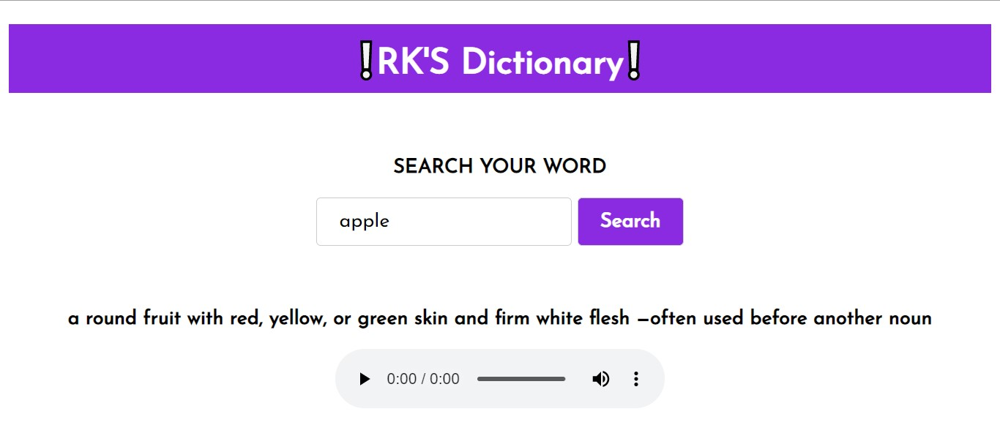
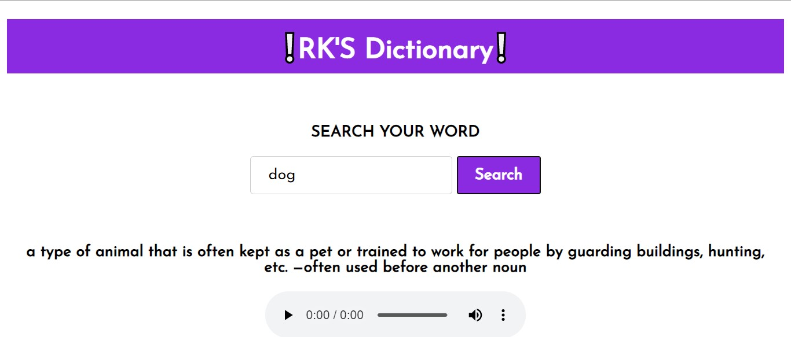

# dictionary

**A Dictionary using HTML,CSS,JS** 
 
**on clicking the search button we fetch the data from server and show it to user** 
 
**It also tells us the pronunciation of word as audio file** 
 
